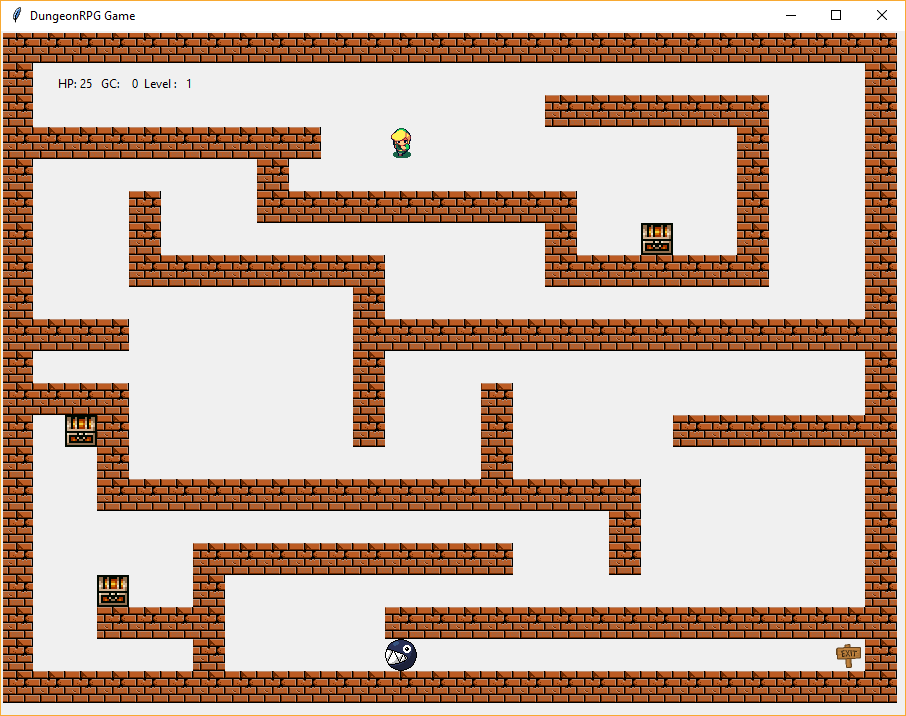

# DungeonRPG

Requires Python 3

###To play:###

- Clone repository
- Launch the command "py game.py"
- Build your own levels, naming them level_2, level_3 etc..
- Enjoy!

### Screenshot

### TO DO:

- Improving impact gesture
- Floor sprite
- Improving the generation algorithm
- Adding a shop
- Going more RPG
